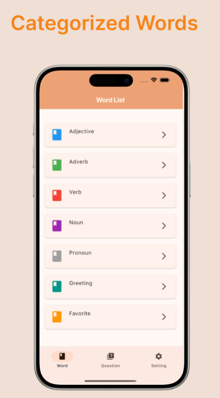
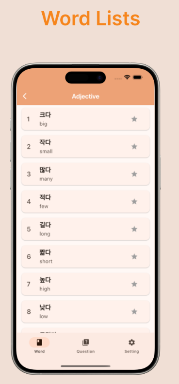
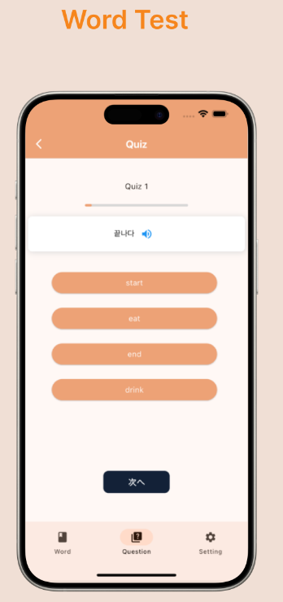
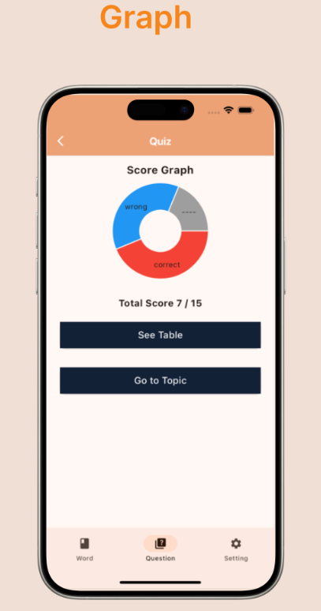

# 概要

### 一つのリポジトリで何種類もの言語アプリを開発します


ハングル初級 iosリリース済み(ja/en) → english 初級 → ハングル日常会話編 → korian中級 → korian上級(ハン検2級相当) 

※ アンドロイドはテスター要件が厳しいのでiOSアプリの反応を見て決める。









# ビルド
※ apps側で個人のfirebaseの完了前提

```sh
$ make bs
```

# ディレクトリ構造

```sh
root
├── apps                           --- アプリ本体
│   │  
├── packages
│   ├──  core
│   │      ├── dao                 --- infraにデータアクセスするオブジェクト
│   │      └── data                --- アプリのクイズの問題を格納
│   │      └── designsystem        --- font や colorなど アプリのデザイン設定、localization 設定
│   │      └── foundation          --- constans,emun,extensionなど
│   │      └── model               --- core 共通model
│   │      └── ui                  --- アプリで使う共通ui部分
│   │      └── repository          --- network以外のデータ操作を抽象化
│   │      └── router              --- タイプセーフなルート設定
│   │      └── utility             --- logger やその他utility
│   │      └── test_util           --- test用の utility
│   │
│   └── feature
│          └── quiz
│          └── setting
│          └── splash
│          └── wordlist
├── melos.yaml  
├── pubspec.yaml 
└── README.md

```
